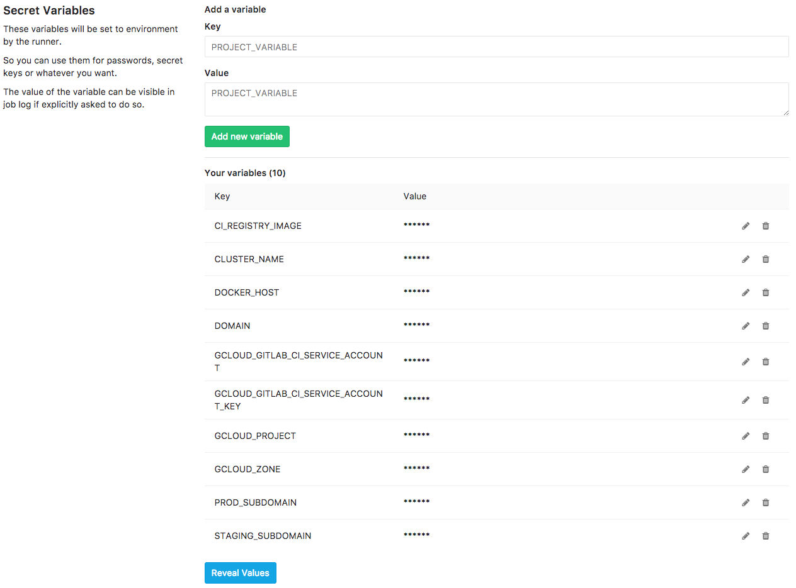
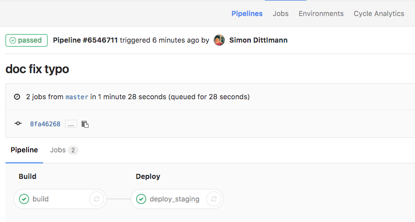
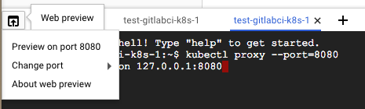

# kbnw-express-app

This repository provides an hello world application based on express which will be automatically deployed to Kubernetes on Google Cloud Platform (GKE) through a gitlab-ci configuration.

# Step by Step

This step by step instructions will help you to get GCP, GKE up and running and wire everything with a gitlab installation -- even gitlab.com.
If you don't trust the shared gitlab-ci-runner on gitlab.com check out this related [how-to](./k8s/gitlab-ci-runner/README.md) to have your own runners on your GKE/Kubernetes cluster.

1. Create your Google Cloud Platform Account at https://console.cloud.google.com
1. Start Cloud Shell
1. Clone git repository `git clone https://github.com/Pindar/gcloud-k8s-express-app.git && cd gcloud-k8s-express-app/`
1. Setup GCloud project `./k8s/gcp/setup_gcloud_project.sh [test-gitlabci-k8s-XXX]`, wait until project is ready
1. Setup GCloud resources `./k8s/gcp/setup_gcloud_resources.sh [test-gitlabci-k8s-XXX]`
1. Get gitlab-ci-token and prepare it for gitlab-ci `cat gitlab-ci-token.json | base64`, copy output to clipboard on a mac e.g., `… | pbcopy` (note: in case you copy from the cloud console please copy the base 64 encoded string first into a local file and from there again to the clipboard. A direct copy/paste doesn't work)
1. Prepare variables at gitlab-ci

| Name                                 | Value                                                                     |
|--------------------------------------|---------------------------------------------------------------------------|
| GCLOUD_GITLAB_CI_SERVICE_ACCOUNT_KEY | output of previous step                                                   |
| CI_REGISTRY_IMAGE                    | eu.gcr.io/test-gitlabci-k8s-XXX/kbnw-express-app                          | 
| CLUSTER_NAME                         | example-cluster                                                           |
| GCLOUD_GITLAB_CI_SERVICE_ACCOUNT     | gitlab-ci-token@test-gitlabci-k8s-XXX.iam.gserviceaccount.com             |
| GCLOUD_ZONE                          | europe-west1-b                                                            |
| DOMAIN                               | your domain name, e.g., example.com                                       |
| PROD_SUBDOMAIN                       | your production subdomain, e.g., www for www.example.com                  |
| STAGING_SUBDOMAIN                    | your staging subdomain, e.g., citeststaging for citeststaging.example.com |

1. let it run on gitlab-ci 
1. update your DNS settings to the new ingress IP `kubectl --namespace=production get ing`
1. Proxy to your Cluster. First run `kubectl proxy --port 8080` and second start web preview, see 

*In case you run it locally on your pc or mac*

1. configure kubectl `gcloud auth application-default login && gcloud --quiet container clusters get-credentials example-cluster --zone europe-west1-b && export KUBERNETES_CONFIG=~/.kube/config`
1. [OPTIONAL] activate context `kubectl config get-contexts`, `kubectl config use-context [CONTEXT_NAME]`

## Clean up

*kubectl config*

1. Remove context; list them `kubectl config get-contexts`, remove `kubectl config delete-context [CONTEXT_NAME]`
1. Remove cluster; list them `kubectl config get-clusters`, remove `kubectl config delete-cluster [CLUSTER_NAME]`

*project/resources*

1. `./k8s/gcp/tear_down_gcloud_resources.sh [test-gitlabci-k8s-XXX]`
1. `./k8s/gcp/tear_down_gcloud_project.sh [test-gitlabci-k8s-XXX]`
